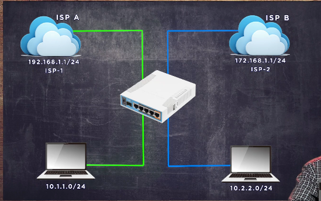
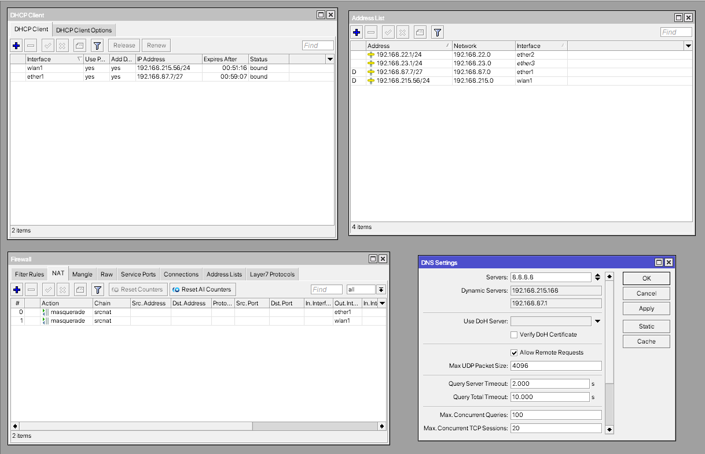
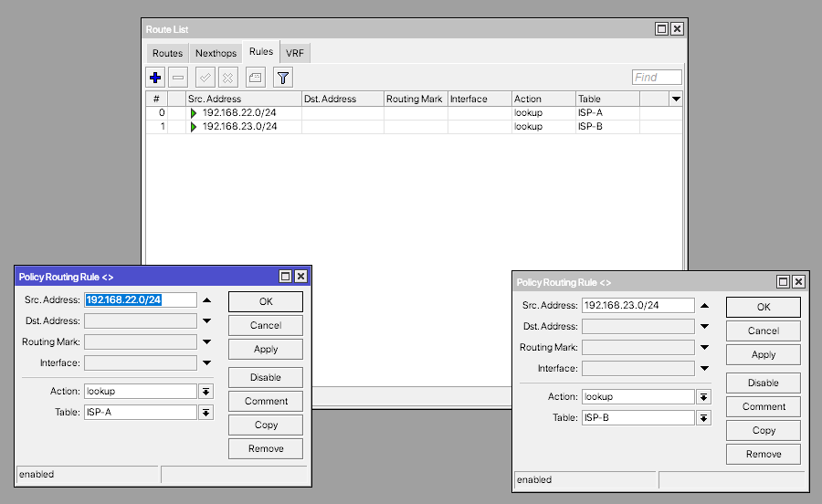
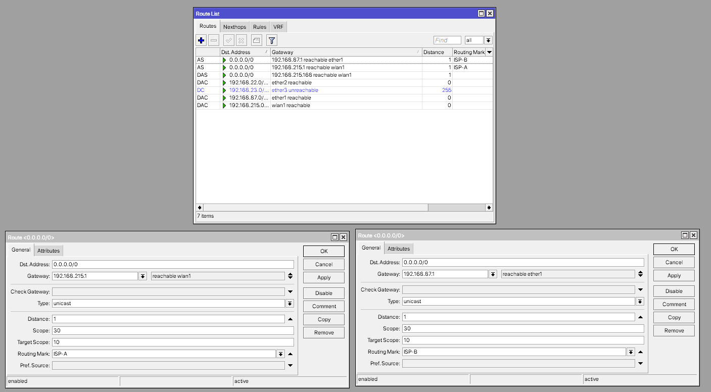
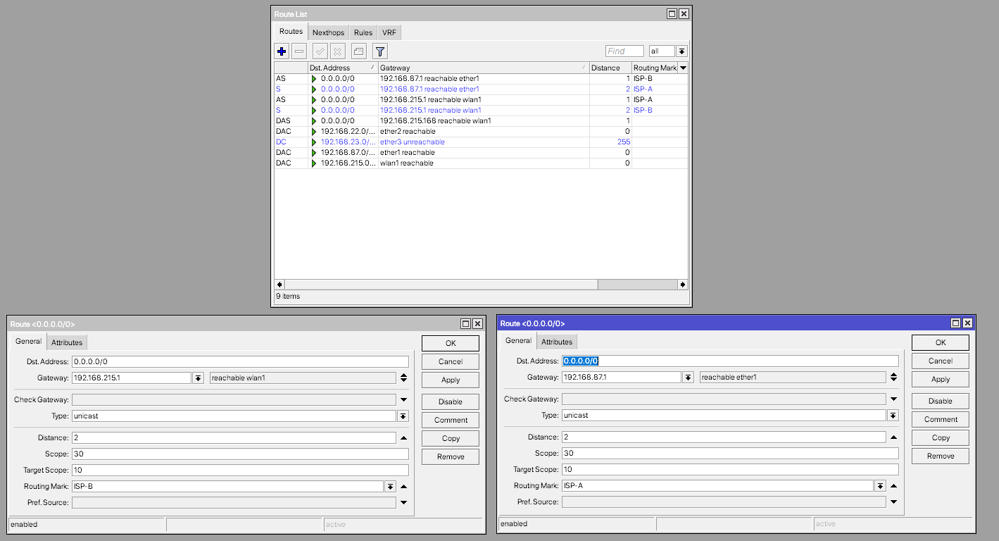
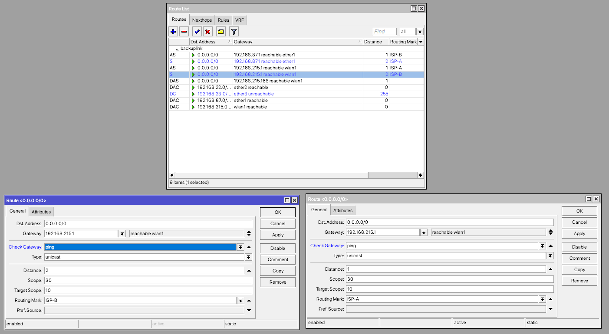
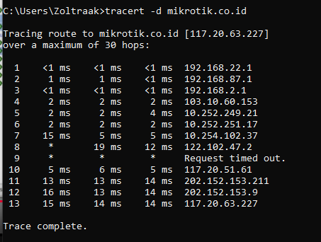

# LAB-33-Policy-Based-Route
Rabu 20 Agustus 2025  
  
# Policy Based Route
  PBR merupakan fitur yang berfungsi memetakan jalur. Kita bisa memetakan berdasarkan alamat IP tujuan, IP asal, bisa juga kita buat yang lebih spesifik lagi berdasarkan koneksi (port dan protokol). Biasanya digunakan jika kita memiliki lebih dari 1 link menuju provider agar lebih efisien. Tujuan utamaknya adalah untuk memisahkan service, layanan atau jaringan tertentu agar mengunakan jalur ISP yang berbeda. Dan pemetaan jalur ini bisa disesuaikan dengan kondisi yang ada dilapangan. Agar lebih efisien dan tidak ada down time di jaringan, PBR bisa di kombinasikan dengan failover. Yang berfungsi saat salah saru link atau ISP putus maka bisa mengunakan jalur atau link yang masih tersedia. Penggunaan PBR ini tidak terbatas hanya dengan 2 link menuju ISP, tetapi bisa saja lebih banyak lagi.  
  
# Konfigurasi PBR  
    
  1. Pastikan kita sudah melakukan basic config (IP Address, DNS, NAT, dll). Kemudian kita bisa coba untuk lakukan konfigurasi PBR. Pada kasus ini kita akan konfigurasi PBR1 menggunakan Route Rules.  
    
  2. Sekarang pergi ke **IP > Route** lalu kita **add**, untuk alamat ip asalnya (src. Address) kita bisa isi dengan alamat IP dari LAN A **192.168.22.0/24**, dan actionnya **lookup**.  
  
  3. Lalu buat lagi untuk IP **192.168.23.0/24**.  
  
  4. Selanjutnya pindah ke tab **routers** masih di menu Route. Tambahkan rute baru. Arahkan ISP1 ke gateway 192.168.215.1 dan ISP2 ke 192.168.87.1. Kemudian **mark** nya arahkan sesuai dengan routing mark yang telah kita buat sebelumnya.  
  
  5. Untuk konfigurasi PBR cukup sampai disini, namun ISP1 sedang bermasalah jadi LAN A tidak bisa konek ke internet, maka kita akan buatkan Failover pada PBR. Caranya tambahkan route baru **add**. Gateway kita isi dengan ISP1 dulu, karna ini menjadi link backup parameter **distance** nya ubah jadi **2** dan selanjutnya routing marknya mengunakan routing mark ISP B. Lalu tambahkan lagi satu lagi gateway ISP B, distance 2 dan marknya ISP A.  
  
  6. Selanjutnya kita perlu memanfaatkan parameter Check Gateway supaya fitur Failover ini bisa berjalan. ita aktifkan **Check Gateway** di route ISP A dan B (bukan yang backup) menjadi **ping**.  
  
  7. Sekarang pengujian, kita coba seolah olah ISP B sedang bermasalah.  

# Kesimpulan
  PBR (Policy Based Route) merupakan fitur yang berfungsi untuk memetakan jalur. Tujuan utamanya adalah untuk memisahkan service, layanan atau jaringan tertentu agar menggunakan jalur ISP yang berbeda. Dan pemetaan jalur ini bisa disesuaikan dengan kondisi yang ada dilapangan.  

# Sumber
Youtube - Citraweb - https://www.youtube.com/watch?v=lOFeclNAM4Q&t=17s  
